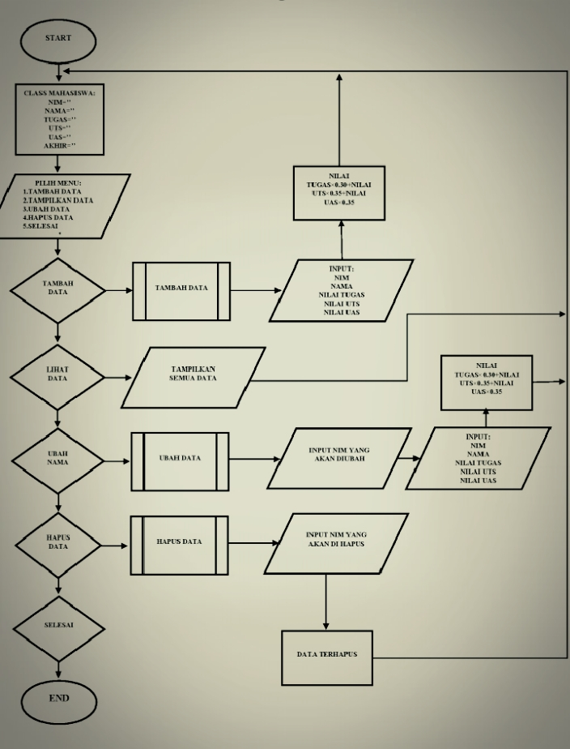
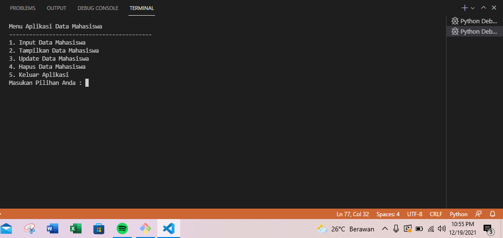
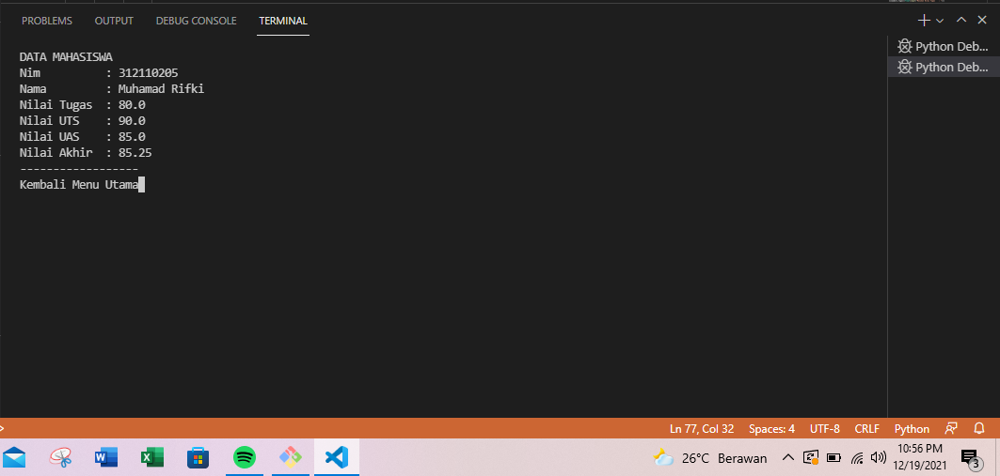

# praktikum8
## program
Tugas Praktikum

Buat program sederhana dengan mengaplikasikan penggunaan class. Buatlah

class untuk menampilkan daftar nilai mahasiswa, dengan ketentuan:

• Method tambah() untuk menambah data

• Method tampilkan() untuk menampilkan data

• Method hapus(nama) untuk menghapus data berdasarkan nama

• Method ubah(nama) untuk mengubah data berdasarkan nama

• Buat diagram class, flowchart dan penjelasan programnya pada
README.md.

• Commit dan push repository ke github.

### Beikut merupakan program input data mahasiswa dengan pengaplikasian class
Untuk flowchart nya seperti ini

Berikut beberapa pemaparan dari setiap syntax input nya

Input untuk mengimport untuk mendapatkan clear system os

    from os import system

Input untuk membuat class untuk menampung data mahasiswa beseerta atribut nya

    class mahasiswa:
        nim=""
        nama=""
        tugas=""
        uts=""
        uas=""
        akhir=""

Input untuk daftar menu yang akan di tampilkan

    def menu():
    system("cls")
    print("Menu Aplikasi Data Mahasiswa");
    print("-"*43)
    print("1. Input Data Mahasiswa")
    print("2. Tampilkan Data Mahasiswa")
    print("3. Update Data Mahasiswa")
    print("4. Hapus Data Mahasiswa")
    print("5. Keluar Aplikasi")
    pilih= int(input("Masukan Pilihan Anda : "))
    if pilih == 1:
        pilih1()
        menu()
    elif pilih == 2:
        tampil()
        input("Kembali Menu Utama")
        menu()
    elif pilih == 3:
        index_update=-1
        tampil()
        id_edit = int(input("Input NIM yang akan diupdate "))
        for a in range(0, len(datasiswa)):
            if id_edit==datasiswa[a].nim:
                index_update=a
                break
        if (index_update > -1):
            print("INPUT DATA YANG DI UPDATE")
            siswa=mahasiswa()
            siswa.nim=(int(input("Msdukan NIM                      : ")))
            siswa.nama=(input("Masukan Nama Mahasiswa          : "))
            siswa.tugas=(float(input("Masukan Nilai Tugas              : ")))
            siswa.uts=(float(input("Masukan Nilai Uts              : ")))
            siswa.uas=(float(input("Masukan Nilai Uas              : ")))
            siswa.akhir=siswa.tugas*0.30+siswa.uts*0.35+siswa.uas*0.35
            datasiswa=[index_update]=siswa
            print("Berhasil Update Data Mahasiswa")
        else : print("NIM Tidak Ditemukan")
        input("Kembali Menu Utama")
        menu()
    elif pilih ==4:
        system("cls")
        tampil()
        index_update=-1
        id_hapus = int(input("Input NIM Yang Akan Dihapus"))
        for a in range (0, len(data)):
            if id_hapus==datasiswa[a].nim:
                index_delete = a
                break
        if(index_delete > -1):
            del datasiswa[index_delete]
            print("Data Telah Dihapus")
        else:
            print("NIM Tidak Ditemukan")
            input("Kembali Menu Utama")
            menu()
            menu()
    elif pilih ==5 :
        exit()
Dan beberapa input lain untuk menambah kan data yang akan di masukan bisa kalian liat sajah di scyrpt yang sudah saya berikan

seperti contoh input untuk memasukan data mahasiswa

    def pilih1():
    ulang = "Y"
    while ulang in("y","Y"):
        system("cls")
        siswabaru=mahasiswa()
        print("INPUT DATA MAHASISWA")
        siswabaru.nim=(int(input("Masukan NIM            : ")))
        siswabaru.nama=(input("Masukan Nama Mahasiswa : "))
        siswabaru.tugas=(float(input("Masukan Nilai Tugas    : ")))
        siswabaru.uts=(float(input("Masukan Nilai UTS      : ")))
        siswabaru.uas=(float(input("Masukan Nilai UAS      : ")))
        siswabaru.akhir=siswabaru.tugas*0.30 + siswabaru.uts*0.35 + siswabaru.uas*0.35
        datasiswa.append(siswabaru)
        ulang=input("Apakah Anda Ingin Mengulang (Y/T)? ")
menu()

## Berikut juga saya akan Menampilkan hasil output atau run dari Program di atas 
menampilkan menu pilihan yang ingin kalian pilih seperti ini

Berikut untuk menampilan data yang sudah kita buat dari menu pertama

Dan seperti itu saja yang bisa saya paparkan terimakasih
